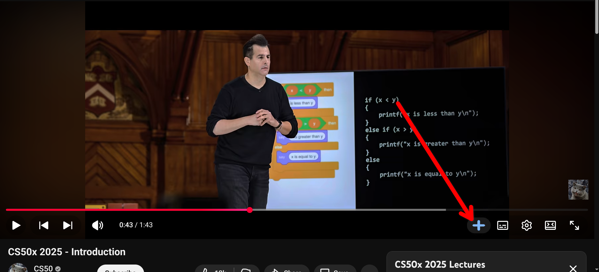
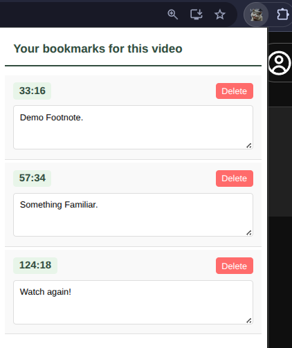
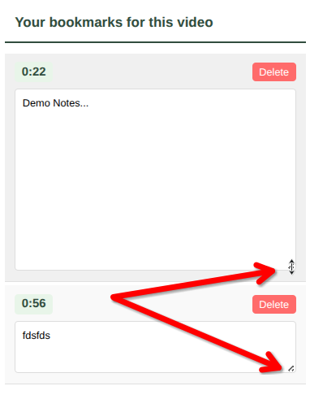
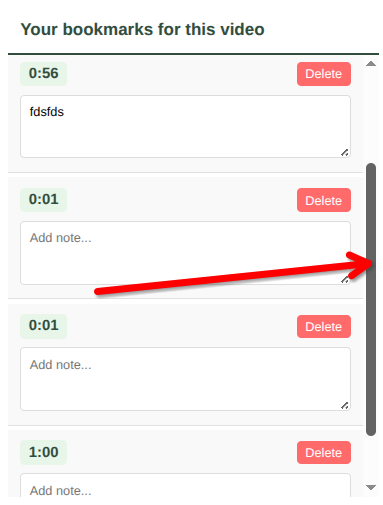

# youtube-notes-extension
A Chrome extension allows users to mark timestamps of a YouTube video and further provides the functionality of attaching a footnote to that timestamp (if needed).

## Tech Stack

**Client Side:** HTML, CSS, Javascript

## Installation Guide

## Important Files:

`manifest.json` : The most important (and the only mandatory) file which defines the blueprint of the extension. It provides information about its structure, behavior, permissions, and resources to the browser.

`content.js` : This is the content script. It is statically declared in the manifest.json. It is the only file that can **directly** interact with the DOM of a webpage. It does not have access to a lot of the browser APIs which work in the background (due to security reasons).

`popup.html` : This is the file that pops up when the action button is clicked (next to the address bar on most browsers).

`popup.css` : This is the file that contains all of the styling for this project, including (but not limited to) the popup that appears when the action button is clicked.

`popup.js` : This is the logic that controls the behavior of the popup's UI.
## General Structure

*(This is **not** a line by line explanation of the code.)*

### Development Logic (in chronological order):

- The `manifest.json` file is the most important of all. It provides the browser with crucial information such as permissions (like `storage` and `unlimitedStorage`, which allow for the use of chrome.storage.local and extend the default storage capacity of 10MB). Then come the `web_accessible_resources[]` which allow access of the (+) button's image to the content script based on the URL (whether YouTube is present or not). Then, it also sets the default icons of all sizes and other important information related to the `host_permissions` for YouTube (and YouTube only).

- Once, the blueprint (manifest.json) of the project is ready, then it is time to actually get into the project's core logic. The very first step of which is to make sure we are on the YouTube player's page, and then inject (using `content.js`) the button (+) into the YouTube video player controls.

- Then, we add logic to this button such that when it is clicked, it takes the current timestamp of the video and saves it using `chrome.storage.local` in a noSQL database (key-value pair in json format). The key is decided as the YouTube video's id which is the part of the link that comes after `watch?v=`. For example, https://www.youtube.com/watch?v= **h6lqxDwUmJQ&list=PLhQjrBD2T383q7Vn8QnTsVgSvyLpsqL_R&index=1** .

- Storing this data as a json object also takes place in `content.js`. The other values which are associated with the key are the timestamps and the **footnotes**.

- The footnotes are empty at first (by design). Once, this data is stored in `chrome.storage.local`, it is then time to retrieve it. Now, `popup.js` comes into play. It takes a look at the current tab's URL ( using `chrome.tabs.query()`) and then looks that up in the database's keys. If found, it then dynamically generates the  data for the user in `popup.html` (using `chrome.storage.local.get()`).

- Now, this is the part where the user gets to add / edit a footnote to the available timestamps. Whenver something is typed in the footnotes' dilog boxes, and the user shifts focus to another area of the popup, it gets saved to the database (under the respective video_id's respective timestamp).

- There is also a delete button, that removes the timestamp and the respective footnote (if any) from the database.

### Stylistic and Design Choices:

- `popup.css` handles most of the styles that are used for this extension. It makes sure that the popup.html is styled adequately.
- It sets the `overflow` property of the biggest container to `scroll`. And also, allows for vertical resizing of the footnotes' input section.
- The project also  utilizes flexbox model for rendering the timestamps and the respective footnotes.
- This project does not use any service workers (no `background.js` file) since all of the work is done by the content script (`content.js`) which directly interacts with the DOM and also with the database (`chrome.storage.local`).
- For the database, there were 2 other alternatives available. The first one was `chrome.storage.sync` which also allowed for syncing the data accross multiple devices with the same Chrome (Google) account. But the problem with that was limited storage (10kB). The other (more practical) alternative was to create a full fledged database inside the browser called IndexedDB (again a noSQL database), but it would have been much harder to setup.

## Chrome APIs Used

`chrome.tabs.query()` : Queries for tabs matching specified criteria.

`chrome.storage.local.get()` : Retrieves stored data by key.

`chrome.storage.local.set()` : Stores data with a specified key.

`chrome.runtime.getURL()` : Returns the URL of a resource in the extension's directory.

## Lessons Learned

- There is a huge difference between the architecture of Manifest V3 (the latest generation of web extension platform) and its predecessors (Manifest V2 and others). As a developer, it was important to understand this since Chrome and Edge(will soon) have retired Manifest V2 completely.
- Async functions play a major role in the design of the popup's logic (`popup.js`). 
- Flexbox Model in CSS.

## Documentation Used

- [Injecting scripts](https://developer.chrome.com/docs/extensions/get-started/tutorial/scripts-activetab)

- [Overall Understanding](https://developer.mozilla.org/en-US/docs/Mozilla/Add-ons/WebExtensions/Anatomy_of_a_WebExtension)

- [MDN Docs](https://developer.mozilla.org/en-US/docs/Mozilla/Add-ons/WebExtensions/Anatomy_of_a_WebExtension)

- [Manifest V3 Architecture](https://youtu.be/TRwYaZPJ0h8?si=RzsikCpyDxuUHL1A)

- [host_permissions](https://developer.mozilla.org/en-US/docs/Mozilla/Add-ons/WebExtensions/manifest.json/permissions#host_permissions)
